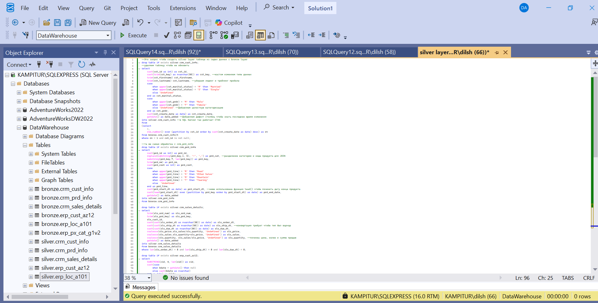
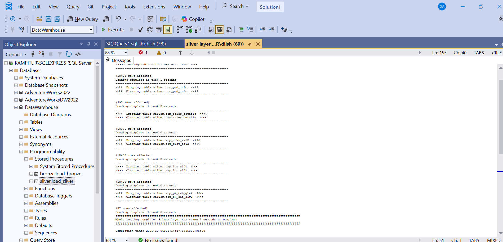

# SQL-data-warehouse-project
-----------------------------------------------------------------------------------
Это проект на SQL Server с применением Data Warehouse архитектуры Medallion
В этом проект я использовал только SQL Server и ничего больше

Здесь использованы:
* DDL
* DML
* Stored Procedures
* Catch and Try
* Decorating Prints
* Bulk Inserts
-----------------------------------------------------------------------------------
# Архитектура базы данных
Архитектура состоит из 2 частей Bronze и Silver, по желанию можно добавить Gold (Бизнес Анализы и вьюхи с полезными запросами)
- Bronze - Сырые данные загруженные прямым инжектом в базу данных с CSV файла
- Silver - Очищенные данные где заполнены нецелостные столбцы, убраны нуллы, убраны дубликаты, созданы категоризации, все значения приведены в один стиль и тип
Фото запросов на SQL Server

